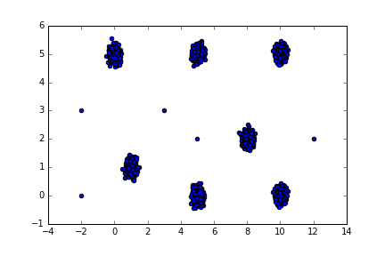
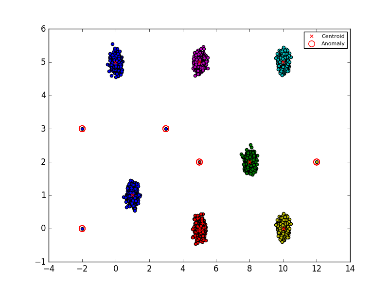

# Anomaly Detection

## Description

In this exercise I was given a dataset of 2D points:

The goal was to find the anomalies, or outliers in the set.

## Results

Check the [IPython notebook](Anomaly Detection.ipynb) for more details.

I tried to solve it with _k_-means to find the clusters and then find the points that are 
too far from the cluster's centroids by using the Euclidian distance. 

This is a scatter plot of my attempt to solve this exercise:

The problem with _k_-means is that the results can differ from each run because the initial centers are 
chosen randomly and the outliers have an impact on the computed center. A possible improvement is to run _k_-means a few times 
and remove the temporarly found outliers from the data. Then the centers will be more accurate and the result more stable.

